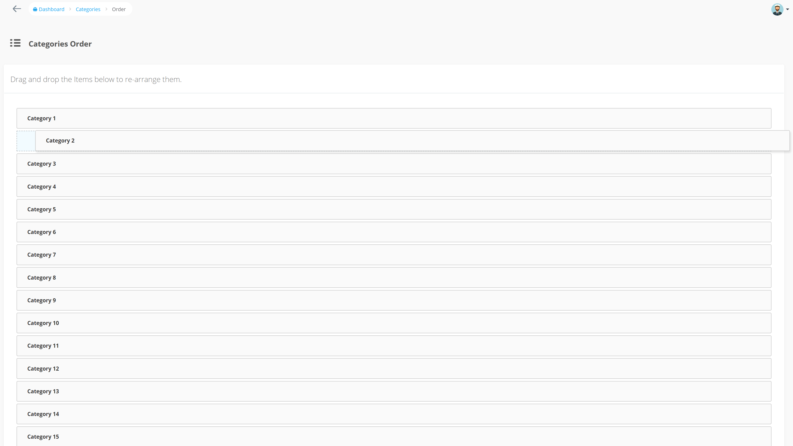

# Введение

При добавлении или редактировании текущего BREAD для таблицы базы данных вы сначала увидите информацию BREAD, которая позволяет вам установить Display Names, slug, icon, `Model` и Controller Namespace, Policy Name. Вы также можете выбрать, нужно ли сгенерировать разрешения для этого типа BREAD.


При прокрутке вниз вы увидите каждую строку, которая связана с этой таблицей, где вы можете выбрать, где в ваших представлениях вы хотите видеть каждое из этих полей:

* BROWSE \(field will show up when you browse the current data\)
* READ \(field will show when you click to view the current data\)
* EDIT \(field will be visible and allow you to edit the data\)
* ADD \(field will be visible when you choose to create a new data type\)
* DELETE \(doesn't pertain to delete so this can be checked or unchecked\)


Вы также можете указать, какой тип формы вы хотите использовать для каждого поля. Это могут быть TextBox, TextArea, Checkbox, Image и другие типы элементов формы.

Некоторые поля имеют дополнительные детали или опции, которые могут быть включены. Эти типы - флажок, выпадающий список, радиокнопка и изображение.

## Валидация

Внутри секции _Optional Details_ для каждой строки в вашем BREAD вы также можете указать правила проверки с помощью простого JSON. Вот пример того, как добавить правило проверки для _required_ и _max length 12_.

```php
{
    "validation": {
        "rule": "required|max:12"
    }
}
```

Кроме того, вы можете добавить некоторые пользовательские сообщения об ошибках, которые могут быть выполнены таким образом:

```php
{
    "validation": {
        "rule": "required|max:12",
        "messages": {
            "required": "This :attribute field is a must.",
            "max": "This :attribute field maximum :max."
        }
    }
}
```

Вы также можете определить несколько правил следующим образом:

```php
{
    "validation": {
        "rule": [
            "required",
            "max:12"
        ]
    }
}
```

### Правила для действий

Вы можете определить отдельные правила проверки для редактирования и добавления:

```text
{
    "validation": {
        "rule": "min:3",
        "edit": {
            "rule": "nullable"
        },
        "add": {
            "rule": "required"
        }
    }
}
```

Вы можете найти список всех доступных правил валидации в [документации Laravel](https://laravel.com/docs/validation#available-validation-rules).

## Теггирование

Тегирование дает возможность добавлять новые элементы в отношения Belongs-To-Many непосредственно при редактировании или добавлении BREAD.

Чтобы активировать эту функцию, вам просто нужно включить `Tagging` в деталях отношений


После этого можно ввести свободный текст в select и нажать клавишу Enter, чтобы сохранить новые отношения.


**Будьте внимательны:**

В нем хранится только `display-column`, поэтому вы должны убедиться, что все остальные поля либо недействительны, либо имеют значение по умолчанию.


## Порядок элементов Bread

Вы можете определить порядок при просмотре BREAD по умолчанию и изменить порядок элементов BREAD с помощью перетаскивания.  
Для этого вам необходимо сначала изменить настройки вашего BREAD:


**Order column** это поле в таблице, где счет хранится как целое число.  
**Order display column** это поле, которое отображается в списке перетаскивания.  
**Order direction** the direction in which the field is ordered.

После этого вы можете перейти на вашу BREAD-страницу просмотра и вы увидите кнопку **Order.**  
Нажав на эту кнопку, вы перейдете на страницу, где вы можете переупорядочить ваши элементы:



## Scope browse-results

Если вы хотите отфильтровать результаты просмотра для BREAD, то вы можете сделать это, создав a [Scope](https://laravel.com/docs/eloquent#local-scopes) в ввашей модели. Например, если вы хотите показывать только те сообщения, которые были созданы текущим пользователем, определите Scope следующим образом:

```php
<?php
public function scopeCurrentUser($query)
{
    return $query->where('author_id', Auth::user()->id);
}
```

Далее перейдите к BREAD-настройкам для `posts`, найдите вход `Scope` и выберите `currentUser`:


После нажатия кнопки "Отправить" вы увидите только свои собственные посты.
