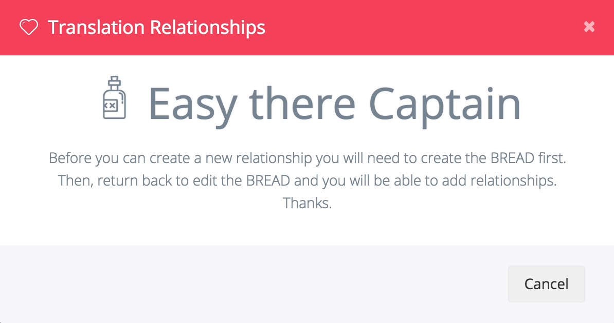

# Отношения

## Добавление отношений

С помощью конструктора BREAD вы можете легко создавать Связи между таблицами. В нижней части страницы вы увидите новую кнопку с надписью "Create Relationship" \(Создать отношения\).



**Уведомление**  
Если вы еще не создали BREAD для таблицы, его нужно будет сначала создать, а затем вернуться после создания BREAD, чтобы добавить отношения. В противном случае вы получите уведомление, которое выглядит следующим образом.




Таким образом, после того, как BREAD уже создан, вы сможете создать новые отношения. После того, как вы нажмете на кнопку "Create Relationship" \(Создать отношения\). Вы увидите новое модальное окно, которое выглядит следующим образом:


Сначала вы укажете, к какому типу отношений это будет относиться, затем выберете таблицу, на которую вы ссылаетесь, и пространство имен, принадлежащее этой таблице. Затем вы выбираете, какая строка объединяет эти таблицы.

Вы также можете указать, какие столбцы вы хотите видеть в выпадающем списке или при множественном выборе.

Теперь Вы можете легко создавать отношения `BelongsTo`, `BelongsToMany`, `HasOne` и `hasMany` непосредственно в Voyager.

## Дополнительные опции

Если вам нужно установить дополнительные параметры для `belongsToMany` отношения, вы можете сделать это после сохранения отношения в подробном поле:

```php
{
    "foreign_pivot_key": "user_id",
    "related_pivot_key": "role_id",
    "parent_key": "id"
}
```

## Сортировка отношений

Вы можете отсортировать результаты отношений, установив объект `sort` в настройках отношений:

```php
{
    "sort": {
        "field": "my_field",
        "direction": "asc"
    }
}
```

Или

```php
{
    "sort": {
        "field": "my_field",
        "direction": "desc"
    }
}
```

Для сортировки по полю `my_field` по убыванию.

## Область видимости отношений \(Scope\)

Вы можете легко отфильтровать показанные опции отношений, определив [local scope](https://laravel.com/docs/eloquent#local-scopes) во внешней модели.  
Например, если вы хотите показать только активные записи, создайте область видимости типа:

```php
public function scopeActive($query)
{
    return $query->where('active', 1);
}
```

И добавьте следующее к опциям отношений:

```php
{
    "scope": "active",
}
```

Значение - это название вашего метода определения масштаба без слова `scope`.  
Значение для `scopeActive()`является `active`. Для `scopeSomeUsers()` это `someUsers`.

