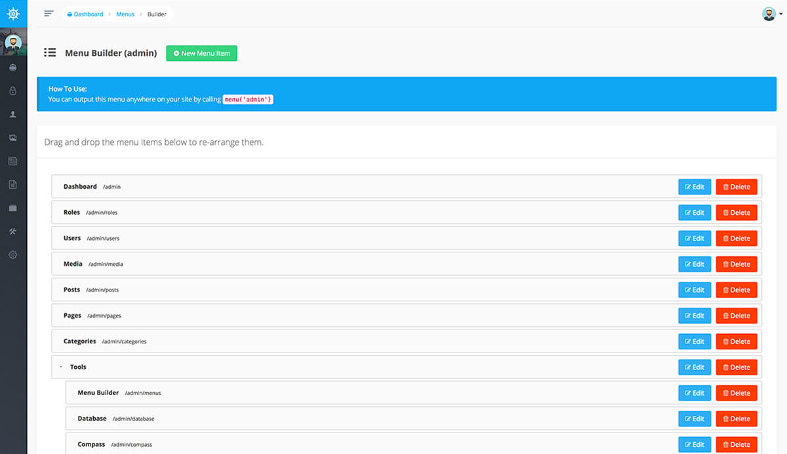

# Menus and Menu Builder

С помощью Voyager вы можете легко создавать меню для своего приложения. На самом деле администратор Voyager использует конструктор меню для навигации, который вы используете слева.

Вы можете просмотреть текущие меню, нажав на кнопку _Tools-&gt;Menu Builder_. Вы можете добавить, отредактировать или удалить любое текущее меню. Это означает, что вы можете создать новое меню для заголовка, боковой панели или подвала вашего сайта. Создайте столько меню, сколько хотите.

Когда вы будете готовы к добавлению пунктов меню, вы можете нажать на кнопку конструктора соответствующего меню:


Это приведет вас в конструктор меню, где вы сможете добавлять, редактировать и удалять пункты меню.



После создания и настройки меню вы можете легко реализовать это меню в своем приложении. Допустим, что у нас есть меню под названием `main`. Внутри любого файла представления (view) мы можем вывести меню, используя следующий код:

```php
menu('main');
```

Это выведет ваше меню в неупорядоченный список. Если вы используете bootstrap для стилизации вашего веб-приложения, вы можете передать второй аргумент в метод отображения меню, сказав ему, что вы хотите стилизовать меню с помощью bootstrap-стилей:

```php
menu('main', 'bootstrap');
```

Сделав еще один шаг дальше, вы можете даже указать свой собственный вид и стилизовать свое меню, как вам угодно. Например, у нас есть файл, расположенный по адресу `resources/views/my_menu.blade.php`, который содержит следующий код:

```markup
<ul>
    @foreach($items as $menu_item)
        <li><a href="{{ $menu_item->link() }}">{{ $menu_item->title }}</a></li>
    @endforeach
</ul>
```

Затем в любом месте, куда бы вы ни захотели отобразить ваше меню, вы можете вызвать:

```php
menu('main', 'my_menu');
```

И теперь будет выведено ваше пользовательское меню.

## Menu as JSON

Если вы не хотите отображать ваше меню, а вместо этого получить массив, вы можете передать `_json` в качестве второго параметра. Например:

```php
menu('main', '_json')
```

Это даст вам коллекцию пунктов меню.

