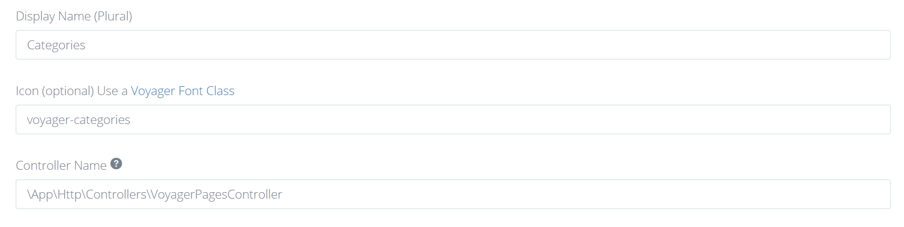
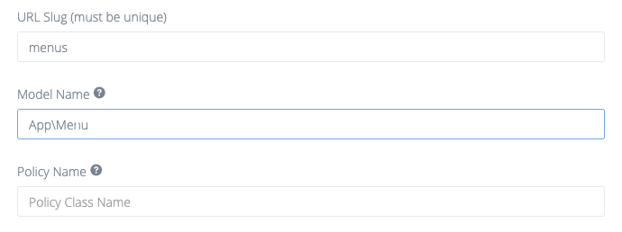

# Переопределение файлов

## Переопределение представлений BREAD

Вы можете переопределить любое представление BREAD для **отдельного** BREAD, создав новую папку в `resources/views/vendor/voyager/slug-name`, где _slug-name_ это _slug_, назначенный для данной таблицы. Есть 4 файла, которые можно переопределить.:

* browse.blade.php
* edit-add.blade.php
* read.blade.php
* order.blade.php

Или же вы можете переопределить представления для **всех** BREADs, создав любой из вышеперечисленных файлов в каталоге `resources/views/vendor/voyager/bread`.

## Использование пользовательских контроллеров

### Переопределение кнопки отправки:

Вы можете переопределить кнопку отправки без необходимости переопределять весь `edit-add.blade.php`, расширив раздел `submit-button`: 

You can override the submit button without the need to override the whole `edit-add.blade.php` by extending the `submit-buttons` section:

```text
@extends('voyager::bread.edit-add')
@section('submit-buttons')
    @parent
    <button type="submit" class="btn btn-primary save">Save And Publish</button>
@endsection
```

### Использование пользовательских контроллеров

Вы можете переопределить контроллер для отдельного BREAD, создав контроллер, расширяющий контроллер Voyagers, например:

```php
<?php

namespace App\Http\Controllers;

class VoyagerCategoriesController extends \TCG\Voyager\Http\Controllers\VoyagerBaseController
{
    //...
}
```

После этого перейдите к настройкам BREAD и заполните Имя контроллера (Controller Name) своим полным именем класса:



Теперь вы можете переопределить все методы из [VoyagerBaseController](https://github.com/the-control-group/voyager/blob/1.1/src/Http/Controllers/VoyagerBaseController.php).

## Переопределение контроллеров Voyagers


**Используйте этот метод только в том случае, если вы знаете, что делаете**  
Мы не рекомендуем и не поддерживаем переопределение всех контроллеров, так как в будущих обновлениях вы не получите никаких изменений кода.


Если вы хотите переопределить любой из основных контроллеров Voyager, вам сначала нужно изменить ваш конфигурационный файл `config/voyager.php`:

```php
/*
|--------------------------------------------------------------------------
| Controllers config
|--------------------------------------------------------------------------
|
| Here you can specify voyager controller settings
|
*/

'controllers' => [
    'namespace' => 'App\\Http\\Controllers\\Voyager',
],
```

Затем выполните команду `php artisan voyager:controllers`, после чего Voyager будет использовать контроллеры, созданные в `App/Http/Controllers/Voyager`.

## Переопределение моделей Voyager

Вы также можете переопределить модели Voyager, если это необходимо.  
Для этого в метод register в вашем AppServiceProviders необходимо добавить следующее:

```php
Voyager::useModel($name, $object);
```

Где **name** — это имя класса модели,  
а **object** — полное имя вашей пользовательской модели.  
Например:

```php
<?php

namespace App\Providers;

use Illuminate\Support\ServiceProvider;
use Illuminate\Events\Dispatcher;
use TCG\Voyager\Facades\Voyager;

class AppServiceProvider extends ServiceProvider
{
    public function register()
    {
        Voyager::useModel('DataRow', \App\DataRow::class);
    }
    // ...
}
```

Следующий шаг — создать свою модель и расширить ее от оригинальной. В случае `DataRow`:

```php
<?php

namespace App;

class DataRow extends \TCG\Voyager\Models\DataRow
{
    // ...
}
```

Если переопределяемая вами модель имеет ассоциированный BREAD, перейдите к настройкам BREAD для переопределяемой модели и замените Имя модели (Model Name) на полное имя вашего класса. Например, если Вы переопределили модель Voyager `Menu` своей моделью `App\Menu`:



